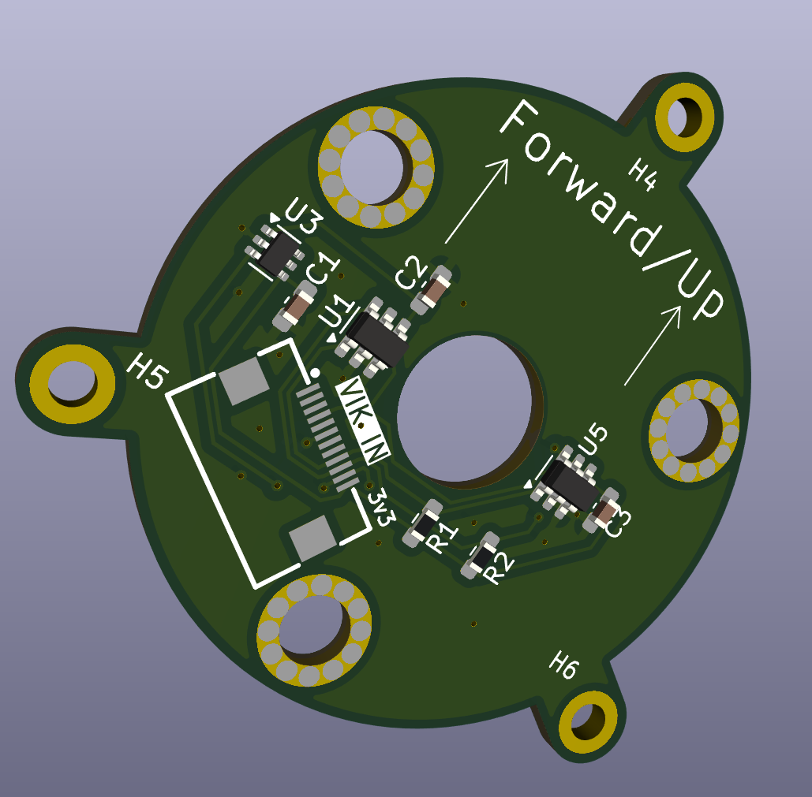

Simple draft of a 6d mouse VIK module concept.

Idea is to solder SMD nuts onto the inner 3 points, and then use those to stabilise the compression springs. Meanwhile the extension springs get hooked over the tabs on the ends and secured with a screw, washer, and nut.
All M2, of course. 

Magnet goes in the middle, and VIK cable just hangs down near it. Bottom design depends on the exact springs purchased I think.

Overall circular diameter is 45mm, inner circle diameter is 35mm.

